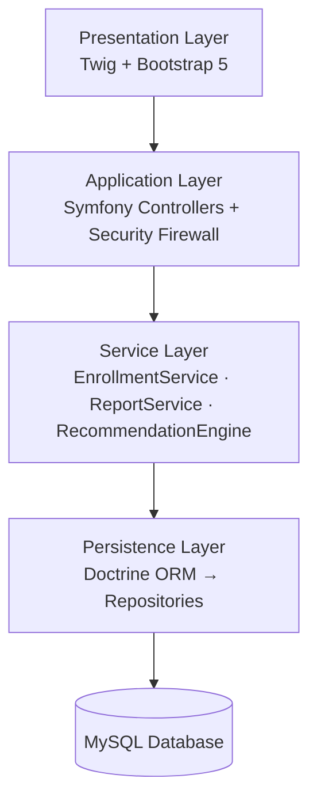

# ElectivoIA

**Intelligent Academic Course Management Platform**

[](https://github.com/maur-ojeda/electivoia)
[](https://symfony.com)
[](https://php.net)
[](LICENSE)

A centralized educational management platform that modernizes elective course enrollment. An AI-powered recommendation engine matches student interests to course offerings, while administrators and teachers get robust tools for quota control, attendance tracking, and academic reporting.

---

## Tech Stack

| Layer | Technology | |
|-------|-----------|------|
| Backend | PHP 8.2 + Symfony 7.3 | Dependency injection, robust business logic |
| ORM | Doctrine 3.5 | DB abstraction and relationship management |
| Frontend | Twig + Bootstrap 5 | Server-side rendering, responsive UI |
| Database | MySQL / MariaDB | Referential integrity |
| Admin | EasyAdmin 4.26 | Auto-generated customizable control panel |
| DevOps | Ubuntu + Nginx + Docker | VPS deployment, PHP-FPM 8.3 |

## Architecture



## Features

- **AI-Powered Recommendations** — matching engine crosses student `InterestProfile` tags with `CourseCategory` labels
- **Multi-Role System** — Students, Teachers, Admins, Parents, SuperAdmin; each role gets a tailored view
- **Enrollment Engine** — atomic transactions with pessimistic locking prevent over-enrollment
- **Attendance Tracking** — digital attendance replacing paper records
- **Admin Dashboard** — EasyAdmin panel with Excel export for official reports
- **Role-Based Security** — Symfony Security with role hierarchies and custom Voters

## Technical Highlights

- **Concurrency Control** — strict transaction handling via Doctrine Pessimistic Locking ensures two students can't grab the last slot simultaneously
- **Custom Security Voters** — parents can only access their own children's data; no cross-family leaks
- **Recommendation Algorithm** — PHP-based engine that crosses `InterestProfile` tags against `CourseCategory` labels for relevant suggestions
- **Clean Architecture** — layered separation between presentation, application, service, and persistence concerns

## Installation

```bash
git clone https://github.com/maur-ojeda/electivoia.git
cd electivoia
composer install
cp .env .env.local
# Configure DATABASE_URL and other secrets in .env.local
php bin/console doctrine:migrations:migrate
php bin/console doctrine:fixtures:load   # optional: seed data
symfony server:start
```

## Screenshots

<!-- Uncomment when screenshots are ready:
### Student Dashboard


### Admin Panel


### Recommendation Engine

-->

## License

This project is licensed under the [MIT License](LICENSE).

---

<p align="center">
  <a href="https://github.com/maur-ojeda">github.com/maur-ojeda</a>
</p>
