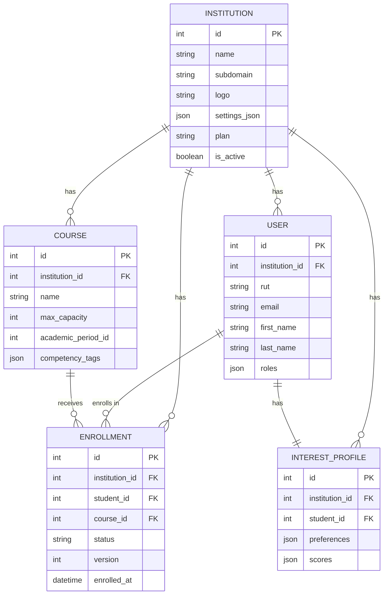

# ADR-003: Arquitectura de Multi-tenencia con Base de Datos Compartida

| Campo | Valor |
|-------|-------|
| **Estado** | Aceptado |
| **Fecha** | 2026-01 |
| **Decisores** | Arquitecto líder |
| **Contexto** | Inicio del proyecto |

## Contexto

ElectivoIA es una plataforma SaaS donde múltiples instituciones educativas (colegios) utilizan la misma instancia de la aplicación. Cada institución necesita:

- Aislamiento completo de sus datos (alumnos, cursos, inscripciones)
- Configuración independiente (reglas de inscripción, períodos académicos, logo)
- Provisioning rápido (una nueva institución debe estar operativa en minutos, no días)
- El SuperAdmin debe poder ver datos de cualquier institución, pero nunca de forma mezclada

Los tres modelos de multi-tenencia son:

1. **Base de datos separada por tenant** — Cada institución tiene su propia DB
2. **Schema separado por tenant** — Una DB, schemas PostgreSQL separados
3. **Base de datos compartida con columna discriminadora** — Una DB, un schema, `institution_id` en cada tabla

## Decisión

Elegimos **base de datos compartida con `institution_id` como columna discriminadora**, usando `TenantFilter` de Doctrine para aplicar el filtro automáticamente.

## Razones

1. **Costo-efectividad en escala MVP**: Con menos de 100 instituciones en el primer año, mantener una DB separada por tenant es un overhead innecesario en costos de infraestructura y complejidad operativa. Una sola DB con columnas discriminadoras es suficiente.

2. **Provisioning instantáneo**: Crear una nueva institución es un simple `INSERT` en la tabla `Institution`. No requiere migraciones, creación de schemas ni aprovisionamiento de DBs adicionales. Esto coincide con HU-SA-02 (provisioning en menos de 30 segundos).

3. **Doctrine TenantFilter**: Symfony/Doctrine ya proporciona filtros a nivel de repositorio que se aplican automáticamente a TODAS las consultas. Una vez configurado, el desarrollador no necesita recordar agregar `WHERE institution_id = ?` a cada query — el ORM lo hace. Esto reduce drásticamente bugs de filtrado.

4. **Consultas cross-tenant para SuperAdmin**: El SuperAdmin necesita ver datos de cualquier institución sin mezclarlos (HU-SA-01). Con DBs separadas, esto requeriría conectarse a múltiples DBs o un data warehouse. Con DB compartida, es un simple `WHERE institution_id = X` que se puede desactivar para queries administrativas.

5. **Simplicidad en migraciones**: Una sola migración aplica para todos los tenants. No hay que correr migrations en N bases de datos por cada cambio de schema.

6. **Redis compartido**: Las cachés de recomendaciones IA ya están aisladas por `institution_id` en las keys de Redis. La misma lógica aplica a la DB.

## Modelo de Datos

## Consecuencias

### Positivas
- Provisioning de nuevas instituciones en segundos (HU-SA-02)
- Una sola migración aplica para todos los tenants
- Queries del SuperAdmin sin complejidad cross-DB
- Costo de infraestructura mínimo en fase MVP
- Doctrine TenantFilter garantiza aislamiento automático

### Negativas
- Cada tabla necesita una columna `institution_id` (overhead de almacenamiento mínimo)
- Si un tenant crece desproporcionadamente, puede afectar performance de otros (mitigable con particionado)
- Migración a modelo separado es compleja si se escala más allá de ~1000 instituciones
- Backup/restore por tenant individual requiere filtrado (no un simple pg_dump de una DB)

### Compromisos
- Aceptamos el riesgo de co-tenancy a cambio de simplicidad operativa en fase MVP
- El modelo es revisable: si ElectivoIA escala a +500 instituciones, podemos migrar a schemas separados manteniendo la misma lógica de aplicación
- RLS de PostgreSQL como segunda capa de seguridad, no como única barrera
- Optimistic locking vía campo `version` en `Enrollment` para concurrencia en últimos cupos

### Plan de migración (si se necesita)
Si el modelo compartido no escala, la migración a schemas separados es directa:
1. Crear un schema por institución
2. Mover datos con `INSERT INTO schema.table SELECT * WHERE institution_id = X`
3. Cambiar el `TenantFilter` para apuntar al schema correcto en vez de la columna
4. Sin cambios en la lógica de negocio