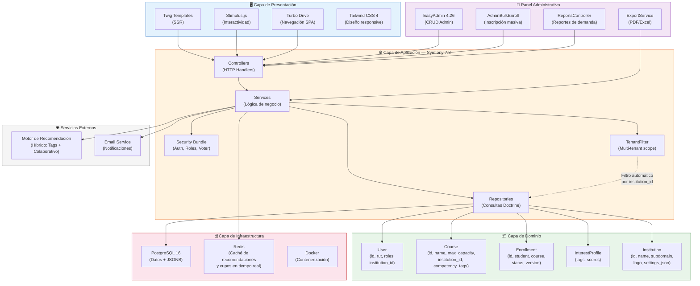
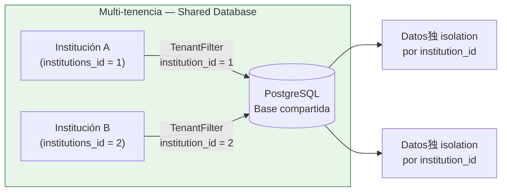

# Arquitectura General — ElectivoIA

Diagrama de arquitectura del sistema mostrando las capas principales y sus interacciones.

## Stack Tecnológico

| Componente | Tecnología | Versión |
|-----------|-----------|---------|
| Backend | PHP + Symfony | 8.2 + 7.3 |
| Base de datos | PostgreSQL | 16 |
| ORM | Doctrine | 2.x |
| Panel Admin | EasyAdmin | 4.26 |
| Frontend CSS | Tailwind CSS | 4 |
| Frontend JS | Stimulus + Turbo | ES modules |
| Caché | Redis | 7.x |
| Contenedores | Docker | - |
| IA Motor | Híbrido (Tags + Colaborativo) | Interno |
| Exportación | Dompdf + PhpSpreadsheet | 3.1.5 / x |

## Modelo de Multi-tenencia

El sistema utiliza **base de datos compartida** con `institution_id` como columna discriminadora. El `TenantFilter` de Doctrine aplica automáticamente el filtro en cada consulta, garantizando aislamiento de datos entre instituciones sin necesidad de schemas separados.

## Referencias a ADRs

- [ADR-001: Por qué Symfony](../adr/ADR-001-why-symfony.md)
- [ADR-002: Por qué PostgreSQL](../adr/ADR-002-why-postgresql.md)
- [ADR-003: Multi-tenencia con base compartida](../adr/ADR-003-why-multitenancy.md)