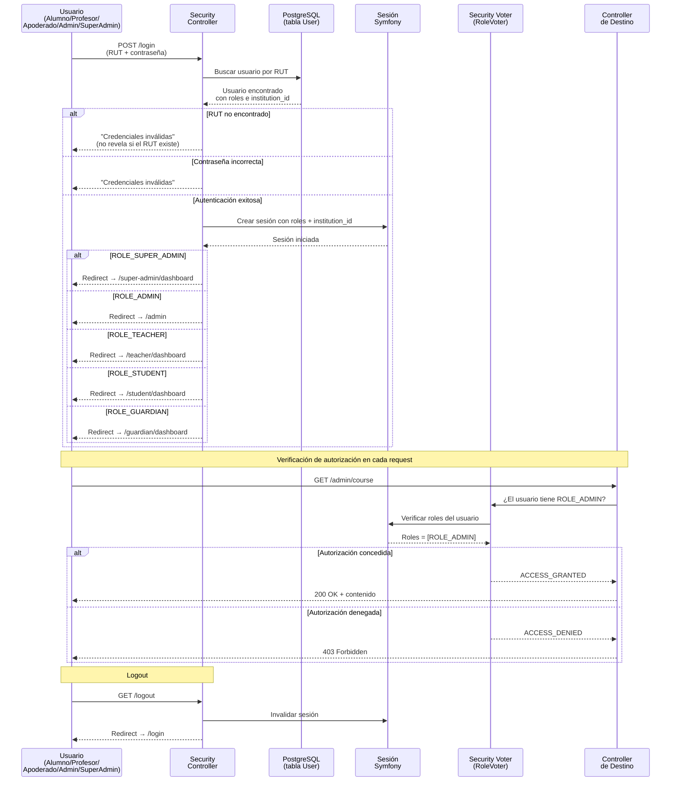

# Flujo de Autenticación y Autorización — Diagrama de Secuencia

Diagrama del flujo de login, generación de sesión, verificación de roles y acceso a rutas según el actor del sistema.

## Roles del Sistema

| Rol | Código | Dashboard | Permisos |
|-----|--------|-----------|----------|
| SuperAdmin | `ROLE_SUPER_ADMIN` | `/super-admin/dashboard` | Gestión global, instituciones, suscripciones |
| Administrativo | `ROLE_ADMIN` | `/admin` | Gestión de cursos, inscripciones, usuarios, reportes |
| Profesor | `ROLE_TEACHER` | `/teacher/dashboard` | Asistencia, muro de curso, feedback vocacional |
| Alumno | `ROLE_STUDENT` | `/student/dashboard` | Explorador, recomendaciones IA, inscripción |
| Apoderado | `ROLE_GUARDIAN` | `/guardian/dashboard` | Seguimiento pupilo, firma de consentimiento |

## Reglas de Seguridad

- Un usuario puede tener múltiples roles (ej: `ROLE_TEACHER` + `ROLE_ADMIN` + `ROLE_GUARDIAN`)
- Autenticación por RUT chileno (formato: `12345678-9`)
- Contraseña inicial: primeros 6 dígitos del RUT (sin guión ni DV)
- `TenantFilter` aplica automáticamente `institution_id` en todas las consultas
- Los `ROLE_STUDENT` no pueden acceder a `/admin` (403 Forbidden)
- Sesiones no autenticadas son redirigidas a `/login`
- El logout invalida la sesión completamente y redirige a `/login`

## Rutas Protegidas

| Ruta | Roles Permitidos |
|------|-----------------|
| `/admin/*` | `ROLE_ADMIN`, `ROLE_SUPER_ADMIN` |
| `/super-admin/*` | `ROLE_SUPER_ADMIN` |
| `/teacher/*` | `ROLE_TEACHER` |
| `/student/*` | `ROLE_STUDENT` |
| `/guardian/*` | `ROLE_GUARDIAN` |
| `/login`, `/logout` | Público |