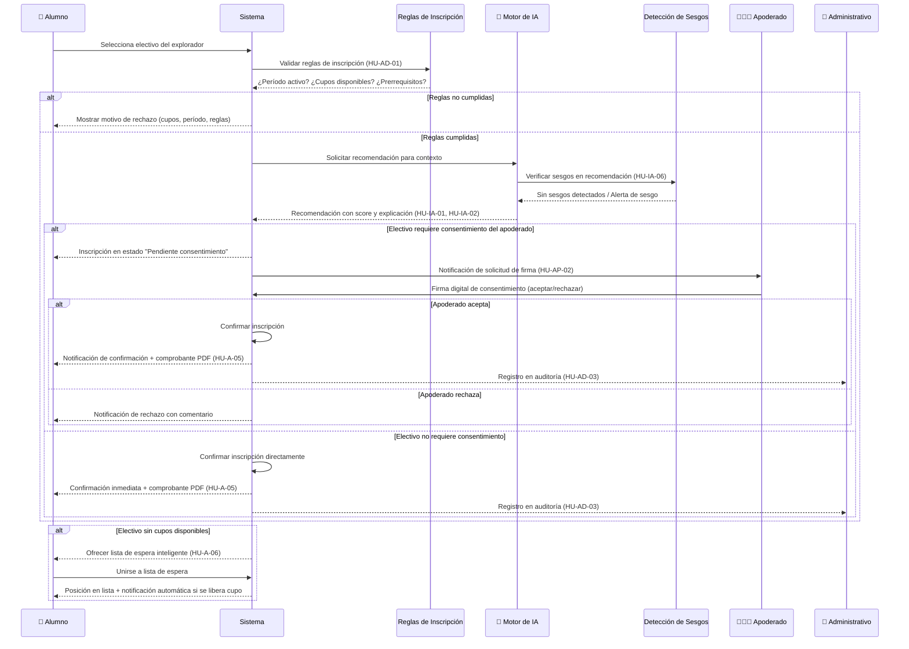

# Flujo de Inscripción — Diagrama de Secuencia

Diagrama de secuencia del flujo completo de inscripción de un Alumno a un electivo, incluyendo validaciones, motor de IA y consentimiento del Apoderado.

## Referencias

| Código | Historia de Usuario |
|--------|-------------------|
| HU-A-03 | Explorador de Electivos con Filtros |
| HU-A-04 | Simulador de Inscripción |
| HU-A-05 | Confirmación de Inscripción con Consentimiento |
| HU-A-06 | Lista de Espera Inteligente |
| HU-AD-01 | Configuración de Reglas de Inscripción |
| HU-AD-03 | Auditoría de Procesos de Inscripción |
| HU-AP-02 | Firma Digital de Consentimiento |
| HU-IA-01 | Recomendación por Perfil de Intereses |
| HU-IA-02 | Recomendación por Similitud |
| HU-IA-06 | Detección y Reporte de Sesgos |