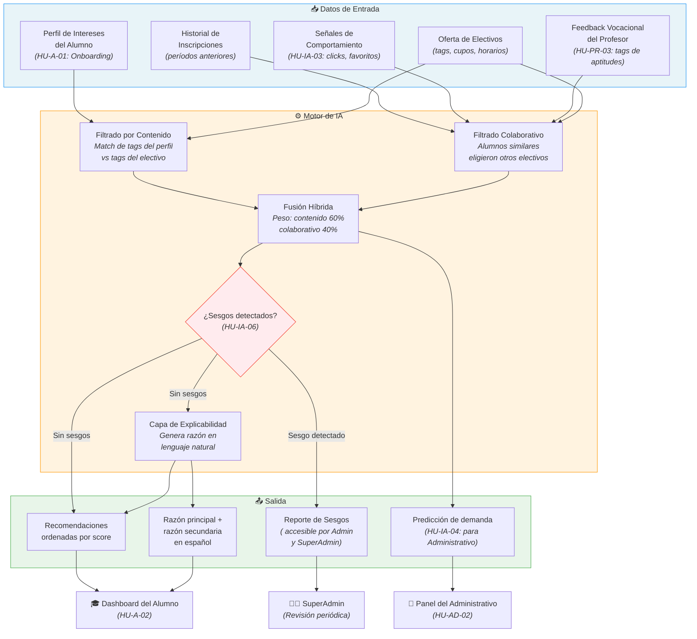
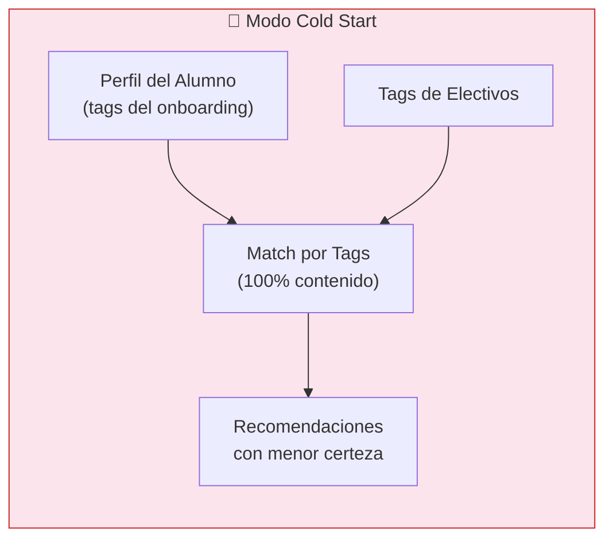

# Motor de Recomendación IA — Diagrama de Flujo

Diagrama de flujo del proceso interno del Motor de IA, desde la entrada de datos hasta la generación de recomendaciones con explicabilidad y detección de sesgos.

## Detalle de las Señales

| Tipo de Señal | Acción | Peso |
|--------------|--------|------|
| Positiva fuerte | Inscripción confirmada | +3 |
| Positiva media | Marcar como favorito | +2 |
| Positiva leve | Ver detalles > 1 vez | +1 |
| Negativa fuerte | Cancelar inscripción | -3 |
| Negativa media | Marcar "No me interesa" | -2 |
| Negativa leve | Abandonar lista de espera | -1 |
| Especial | Feedback del Profesor (HU-PR-03) | +4 (peso diferenciado) |

## Modo Cold Start

Cuando una institución tiene menos de 50 alumnos con historial, el filtrado colaborativo se desactiva y el motor opera solo con filtrado por contenido, basándose exclusivamente en los tags del perfil del alumno y los tags de los electivos.

## Referencias

| Código | Historia de Usuario |
|--------|-------------------|
| HU-A-01 | Onboarding de Perfil de Intereses |
| HU-A-02 | Dashboard de Recomendaciones Explicadas |
| HU-IA-01 | Recomendación por Perfil (Content-Based) |
| HU-IA-02 | Recomendación por Similitud (Colaborativo) |
| HU-IA-03 | Aprendizaje de Señales |
| HU-IA-04 | Predicción de Demanda |
| HU-IA-05 | Panel de Supervisión del Motor |
| HU-IA-06 | Detección y Reporte de Sesgos |
| HU-PR-03 | Feedback Vocacional del Alumno |
| HU-AD-02 | Reportes de Demanda Predictiva |